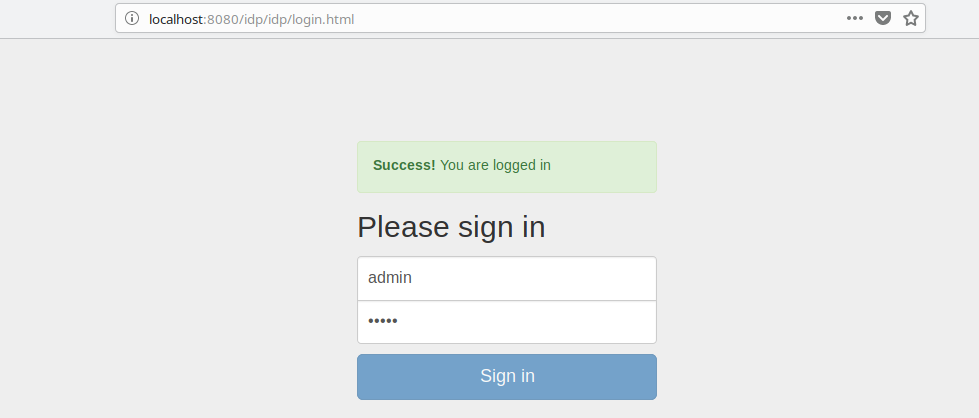

# CUBA IDP Add-on

## Overview

The add-on allows a user to log in to the multiple running applications by entering a single login name and password 
once in a browser session.



## Compatibility with platform versions

| Add-on        | Platform      |
|:------------- |:------------- |
| 0.1.0         | 7.0.0         |

## Installation and configuration

1. Add custom application component to your project (change the version part if needed):

    `com.haulmont.addon.idp:idp-global:0.1.0`

2. Configure add-on with application properties ([documentation](https://doc.cuba-platform.com/manual-6.9/sso.html))

## Demo

This section is a short version of example from documentation ([link](https://doc.cuba-platform.com/manual-6.9/sso_example.html)).

1. Create two projects and add the `idp` add-on in to them
2. Configure aliases in the `hosts` file:

| Address       | Alias         |
|:------------- |:------------- |
| 127.0.0.1     | fish          |
| 127.0.0.1     | chips         |

3. Configure IDP for the Fish project in `web-app.properties` file of the `web` module:

```
cuba.idp.serviceProviderUrls = http://fish:8081/app/,http://chips:8082/app/
cuba.idp.serviceProviderLogoutUrls = http://fish:8081/app/dispatch/idpc/logout,http://chips:8082/app/dispatch/idpc/logout
cuba.idp.trustedServicePassword = mdgh12SSX_pic2

cuba.webAppUrl = http://fish:8081/app/
cuba.web.idp.enabled = true
cuba.web.idp.baseUrl = http://fish:8081/app/idp/
cuba.web.idp.trustedServicePassword = mdgh12SSX_pic2
```

4. Configure IDP for the "Chips" project in `web-app.properties` file of the `web` module:

```
cuba.webAppUrl = http://chips:8082/app/
cuba.web.idp.enabled = true
cuba.web.idp.baseUrl = http://fish:8081/app/idp/
cuba.web.idp.trustedServicePassword = mdgh12SSX_pic2
```


5. Start the Fish server by launching its `tomcat/bin/startup.*` script.

6. Go to [http://fish:8081/app/](http://fish:8081/app/) in your web browser. You will be redirected to the IDP login page. 
Log in with the `admin / admin` credentials. Create a new user, for example `u1`.

7. Start the Chips server by launching its `tomcat/bin/startup.*` script.

8. Go to [http://chips:8082/app/](http://chips:8082/app/) in the same web browser. If you are still logged in to the 
Fish application, you will be automatically logged in as admin to Chips. Create the same u1 user 
(password does not matter) in the `Chips` application.

9. Now you can log in as `admin` or `u1` to both applications via the single login form, and if you are logged in one 
application, the login process for the second application will be automatic, bypassing the login form.
